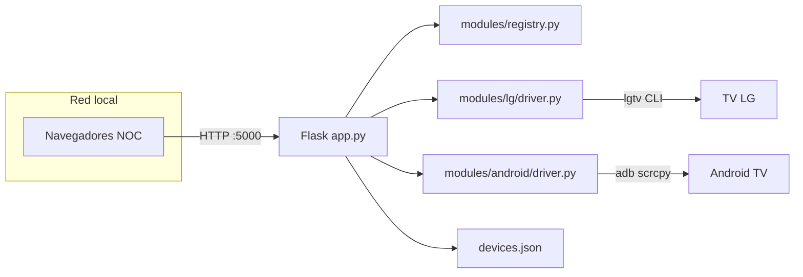

# Arquitectura

## Resumen

Panel web Flask en red local (sin auth). El **PC servidor** ejecuta `lgtv`, `adb` y `scrcpy`; los navegadores del equipo NOC solo envían HTTP.

## Diagrama

## Capas

| Capa | Ubicación | Rol |
|------|-----------|-----|
| HTTP / UI | `app.py`, `routes/`, `templates/` | Páginas y API REST |
| Registro | `modules/registry.py` | Tipos de conexión activos |
| Drivers | `modules/<tipo>/driver.py` | Subprocess hacia CLIs |
| Persistencia | `config.py`, `devices.json` | Inventario de dispositivos |

## Modularización

- Cada tipo de conexión es un **driver** independiente.
- Rutas API: `/api/<tipo>/...` (blueprints en `routes/`).
- `devices.json` usa `connections.lg` y `connections.android` (migración automática desde formato viejo).

## Archivos principales

- [`app.py`](../app.py) — arranque, health, blueprints
- [`config.py`](../config.py) — CRUD y migración JSON
- [`modules/registry.py`](../modules/registry.py) — catálogo de tipos

## Qué no es modular aún

- Sin cola de trabajos ni autenticación (por diseño, red local).
- scrcpy remoto en PC del NOC vía protocolo custom (fase posterior); hoy: screenshot HTTP + `.cmd` descargable.
